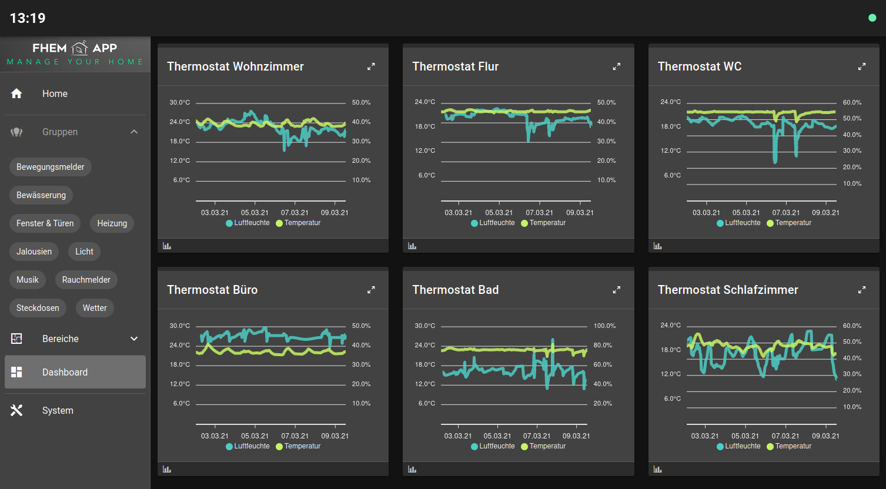
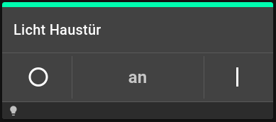
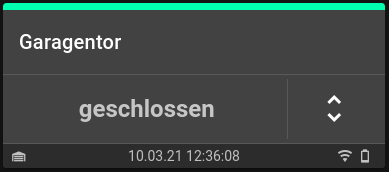
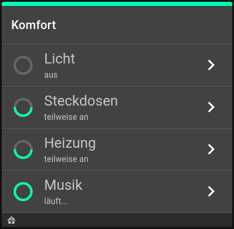
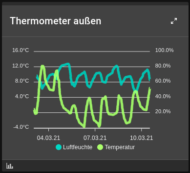

# FHEM App
**FHEMApp** ist eine Web-Application zur Steuerung deiner Smarthome Umgebung. Sie wurde als Frontend für den Einsatz mit FHEM(tm) entwickelt. **FHEMApp** ist für den Betrieb auf unterschiedlichen Geräten optimiert. Die Elemente zur Steuerung der verschiedenen SmartHome-Geräte sind sehr einfach zu bedienen. Für die Einrichtung von **FHEMApp** sind keine Programmierkenntnisse erforderlich. **FHEMApp** wird komplett über FHEM konfiguriert.

*Beispiel für eine Startseite in der Desktopansicht*

*Beispiel für Geräte in der Desktopansicht*

*Beispiel für Grafiken in der Desktopansicht*

*Beispiel für Systemzustand in der Desktopansicht*


*Beispiele für die App in der Smartphoneansicht*

# Systemanforderungen
Für den Betrieb der **FHEMApp** wird FHEM(tm) benötigt.
* FHEM https://fhem.de/
* optional kann die App auch auf einem separaten Web-Server (z.B. Apache https://httpd.apache.org/, lighttpd https://www.lighttpd.net/) betrieben werden.

# Installation
Kopiert einfach alle Dateien und Unterverzeichnisse aus dem Ordner [www/fhemapp](./www/fhemapp) in eure FHEM-Installation unter **opt/fhem/www/fhemapp** bzw. in das gewünschte Verzeichnis auf eurem Webserver. Danach sollte folgende Verzeichnisstruktur auf eurem Webserver vorhanden sein.
```bash
.
└─ fhemapp
    ├── apple-touch-icon.png
    ├── favicon.png
    ├── index.html
    ├── cfg
    ├── css
    ├── img
    └── js
```

# Grundkonfiguration der FHEMApp verändern
Die Grundkonfiguration von **FHEMApp** befindet sich in der Datei `config.json` im Verzeichnis `.../fhemapp/cfg`. In dieser können bei Bedarf Anpassungen vorgenommen werden. Dies ist insbesondere wichtig, wenn ihr **FHEMApp** auf einem separaten Webserver installiert. Die Konfigurationsdatei könnt ihr über einen normalen Texteditor bearbeiten, um die folgenden Einstellungen zu verändern.

### Verbindungseinstellung für FHEM (optional)
Wenn ihr **FHEMApp** unter *opt/fhem/www/fhemapp* abgelegt habt, müssen keine Verbindungseinstellungen in der `config.json` hinterlegt werden. Solltet ihr **FHEMApp** auf einem separaten Webserver (z.B. apache) betreiben, dann sind diese Angaben notwendig. Das folgende Beispiel zeigt die Verbindungseinstellungen für eine Standard FHEM-Installation.
```
"connection": {
  "location": "http://fhem",
  "port": "8083",
  "path": "fhem"
},
```

### Performanceeinstellungen für FHEMApp (optional)
Wenn ihr in **FHEMApp** Daten aus FHEM-Logs in Charts darstellt, ist es ggf. sinnvoll die Anzahl der `maxChartPoints` zu reduzieren um die Ladezeit zu verkürzen. Über den Parameter `logBuffer` könnt ihr die Anzahl der Logeinträge verändern, die **FHEMApp** zwischenspeichert. Dies ist nur für die Fehleranalyse notwendig.
```
"options": {
  "maxChartPoints": 100,
  "logBuffer": 500
},
```

### Themeneinstellungen für FHEMApp (optional)
Zusätzlich könnt ihr das Farbschema von **FHEMApp** individuell anpassen. Grundsätzlich könnt ihr zwischen einem *dunklen* und einem *hellen* Layout über den Parameter `dark` (`true` bzw. `false`) wechseln. Weiterhin könnt ihr die einzelnen Farben für die beiden Farbschemen unter dem Parameter `themes` individuell anpassen. Siehe dazu auch [(Vuetify Customizing)](https://vuetifyjs.com/en/features/theme/#customizing)    
```
"theme": {
  "dark": true,
  "themes": {
    "light": {
      "primary": "#78909C",
      "secondary": "#CFD8DC",
      "accent": "#8bc34a",
      "error": "#e91e63",
      "warning": "#ffc107",
      "info": "#03a9f4",
      "success": "#4caf50"
    },
    "dark": {
    }
  }
}
```

# Grundeinstellung in FHEM
Bevor ihr die gewünschten Geräte für die Anzeige in der **FHEMApp** konfiguriert sind zwei Grundeinstellungen in FHEM notwendig.
1. Müsst ihr in eurem *FHEM-Device* `FHEMWEB` die beiden Attribute `CORS` auf `1` und `longpoll` auf `websocket` setzen. [(siehe auch)](https://fhem.de/commandref_DE.html#FHEMWEB) Das folgende Beispiel zeigt einen Auszug aus der Datei *fhem.cfg* nachdem die Grundeinstellung vorgenommen wurde.
```
define WEB FHEMWEB 8083 global
attr WEB CORS 1
attr WEB longpoll websocket
attr WEB stylesheetPrefix default
```
2. Müsst ihr unter `Global` ein neues User-Attribut `appOptions` definieren. [(siehe auch)](https://fhem.de/commandref_DE.html#global) Das folgende Beispiel zeigt einen Auszug aus der Datei *fhem.cfg* nachdem das User-Attribut hinzugefügt wurde.
```
attr global userattr appOptions:textField-long
```

# Konfiguration der Geräte in FHEM
Jedes SmartHome-Gerät (Device) welches in **FHEMApp** angezeigt werden soll, konfiguriert ihr nun direkt in FHEM. Dazu verwendet ihr das neu angelegte FHEM-Attribut `appOptions` sowie weitere FHEM-Attribute wie `alias`,`group`,`room` oder `sortby`.

### appOptions
Das Attribut `appOptions` kann mit unterschiedlichen Parametern befüllt werden, um die Darstellung des jeweiligen Devices in **FHEMApp** zu steuern. Es wird von **FHEMApp** als Object im `JSON-Format` verarbeitet und kann folgende Parameter beinhalten:

```
{
  "template": "string",             - steuert über welches Template das Device dargestellt wird
  "name": "string",                - kann alternativ zum FHEM-Attribut 'alias' verwendet werden
  "room": "string",                 - kann alternativ zum FHEM-Attribut 'room' verwendet werden
  "group": "string",                - kann alternativ zum FHEM-Attribut 'group' verwendet werden
  "home": "true",                   - zeigt ein Device auf der Startseite an
  "dashboard": "true",              - zeigt ein Device im Dashboard an
  "system": "true",                 - zeigt ein Device in den Systemeinstellungen an
  "setup": { object },              - ermöglicht zustandsabhängige Anpassungen des Templates
  "connected": { object },          - bindet zusätzliche Devices in das Template ein
  "chartDef": ["def1", "def2", ...],- legt die Datenquellen für Grafiken fest
  "link": "string",                 - gibt den URL-Pfad für Panels an  
  "toggle": ["def1", "def2", ...],  - ermöglicht die Definition von "Schaltern"für Panels     
}
```

### Template zuweisen
Damit ein Gerät in der **FHEMApp** zur Verfügung steht, müsst ihr dem jeweiligen Device in FHEM einem *Template* zuordnen. In der **FHEMApp** stehen verschiedene [Templates](#übersicht-der-verfügbaren-templates) zur Verfügung. Dazu nutzt ihr das FHEM-Attribut `appOptions`  und definiert ein *Template* über folgenden Parameter  `{ "template": "switch" }` (Beispiel für einen Schalter)

### weitere FHEM Attribute verwenden
Nachdem ihr dem Device ein *Template* zugeordnet habt, könnt ihr defnieren unter welchem *Name* und in welchen *Menüpunkten* euer Device in **FHEMApp** angezeigt wird. Dazu nutzt ihr das FHEM-Attribut `alias` für den Name des Gerätes, das FHEM-Attribut `group` für die Anzeige im Menüpunkt *Gruppen* und das FHEM-Attribut `room` für die Anzeige im Menüpunkt *Bereiche*. Alternativ können diese Parameter auch über `appOptions` [siehe](#appoptions) definiert werden, wenn ihr die FHEM-Attribute `alias`, `group` bzw `room` in eurer FHEM-Installation anderweitig verwendet.

*Definition in FHEM*<br>


*Anzeige in FHEMApp*<br>


# Aufbau von Standard Templates
In **FHEMApp** werden *Standard Templates* für viele Aktoren und Sensoren zur Verfügung gestellt. Jedes *Standard Template* besteht aus einer Grundstruktur mit einheitlichen Elementen.

- **die Statusbar** - diese zeigt den aktuellen Status über einen farbigen Streifen am oberen Rand des *Templates* an.
- **die Gerätebezeichnung** - befindet sich direkt unter der *Statusbar* und zeigt den Wert aus dem FHEM-Attribut `alias` oder den über `appOptions` definierten Wert an.
- **der Steuerteil** - befindet sich unter der *Gerätebezeichnung* und enthält die im *Template* definierten Tasten bzw. Statuswerte. Der Steuerteil kann mehrere Ebenen enthalten, sodass mehrere Tasten oder Statuswerte angezeigt werden können. Verfügt das Template über mehrere Ebenen, so wird ein kleines Symbol für die Umschaltung der Ebenen rechts neben der Gerätebezeichnung ausgegeben.
- **die Infobar** - befindet sich am unteren Rand und zeigt weitere Informationen zum jeweiligen *Device* an.

*Beispiel für ein Standard Template*<br>


Standard Templates können über `appOptions` individuell angepasst werden. Zudem können eigene Templates in der Datei `config.json` definiert werden. Die Anpassungsmöglichkeiten werden [hier](#standard-templates-anpassen) beschrieben.

Grundsätzlich ist es möglich weitere Templates auf Basis des Vue/Vuetify-Frameworks [siehe](https://vuetifyjs.com/en/) zu entwickeln und in **FHEMApp** zu integrieren.   

# Standard Templates anpassen
Standard Templates enthalten eine Vielzahl von Elementen. Jedes Element kann dabei auf `Readings`, `Attribute` oder `Internals` von FHEM-Devices zugreifen und auf deren Werte reagieren.

Jedes Element kann direkt über `appOptions` angepasst werden. Dies erfolgt über den Parameter `setup`
```
{ "template": "switch", "setup": { "status": {...}, "main": [...], "info": {...} } }
```
Alternativ können eigene Templates in der Datei `config.json` als Vorlage abgelegt werden. Dies erfolgt unter dem Parameter `custom`
```
{
  "connection": { ... },
  "options": { ... },
  "theme": { ... },
  "custom": [
    {
      "name": "example",
      "author": "name",
      "date": "YYYY-MM-DD",
      "status": {
        "bar": ["reading:value:level:color:invert"],
        "error": ["reading:value:level:color:text"]
      },
      "main": [
        {
          "leftBtn": ["reading:value:icon:disabled"],
          "leftClick": ["reading:value:set_param"],
          "leftLong": ["reading:value:set_param"],
          "leftLongRelease": ["reading:value:set_param"],
          "text": ["reading:value:text"],
          "text2": ["reading:value:text"],
          "slider": ["reading:value:set_param:current:min:max"],
          "rightBtn": ["reading:value:icon:disabled"],
          "rightClick": ["reading:value:set_param"],
          "rightLong": ["reading:value:set_param"],
          "rightLongRelease": ["reading:value:set_param"]
        }
      ],
      "info": {
        "left1": ["reading:value:text:icon"],
        "left2": ["reading:value:text:icon"],
        "mid1": ["reading:value:text:icon"],
        "mid2": ["reading:value:text:icon"],
        "right1": ["reading:value:text:icon"],
        "right2": ["reading:value:text:icon"]
      }
    }
  ]
}
```
## Zuweisung von Elementen
Damit ein Element auf den Wert eines bestimmten `Readings` reagieren kann, muss dies entsprechend definiert werden. Jede Zuweisung enthält mindestens ein *reading*, einen *wert* und einen bzw. mehrere *Parameter*.
- **reading** kann sowohl auf `Readings`, `Attribute` als auch  `Internals` eines FHEM-Devices zeigen.
- **wert** kann *strings*, *zahlen* oder *regexp* enthalten. Für Zahlen gilt *reading >= wert*
- **parameter** betrifft das Element selbst, also z.B. das Icon, den Text oder die Farbe. *Hinweis:* Die Parameter sind je Element definiert und müssen ein der korrekten Reihenfolge angegeben werden. (siehe verfügbare Elemente)

Beispiele:
- `["state:on:an"]` prüft das FHEM-Reading `state` auf den Wert `on` und liefert für das Element den Text `an` zurück.
- `["level:30:mdi-weather-sunny"]` prüft das FHEM-Reading `level` auf den Wert >=30 und gibt das Icon `*` zurück.
- `["state:on:an","state:off:aus","state::Status %s"]` prüft das FHEM-Reading `state` der Reihenfolge nach zuerst auf den Wert `on`, danach `off` und zuletzt jeden beliebigen anderen Wert. Im letzten Fall wird *%s* durch den Wert des Readings ersetzt.

### Ersetzungsmöglichkeiten
- **%s** - liefert das *Reading* als Zeichenkette
- **%n.2** - liefert das *Reading* als Zahlenwert mit der gewünschten Anzahl an Nachkommastellen. Sollte das Reading aus Text und Zahlen bestehen, so wird der erste Zahlenwert zurückgegeben
- **%i1** - erhöht (%i1.5) bzw. verringert (%i-1.5) das *Reading* um den Wert. Hierfür muss das *Reading* Zahlenwerte enthalten.
- **%t** - liefert das *Reading* als Zeitstempel im Format TT.MM.JJJJ hh:mm:ss zurück
- **%v** - ausschließlich in Verbindung mit dem Element *slider* notwendig.

## verfügbare Elemente
|Bereich|Element|Zuweisung|Beschreibung|
|-------|-------|-----|-------------|
|status|bar|reading:wert:level:color:invert|definiert mit welcher **Farbe** und mit welchem **Level** der Status angezeigt wird. Bei Angabe von invert wird *level* invertiert|
|status|error|reading:wert:level:color:text|definiert mit welcher **Farbe** und mit welchem **Level** Fehler angezeigt werden. Weiterhin wird die **Fehlermeldung** definiert.|
|main|leftBtn|reading:wert:icon:disabled (alternativ: icon)|definiert welches *Icon* auf der linken Taste angezeigt wird. Optional kann das Flag *disabled* gesetzt werden. Icon Bibliothek [siehe](https://materialdesignicons.com/)|
|main|leftClick|reading:wert:cmd|defniert welches FHEM-Kommando bei Klick auf die linke Taste abgesendet wird. *Hinweis:* `set devicename` kann weggelassen werden|
|main|leftLong|reading:wert:cmd|defniert welches FHEM-Kommando bei langem Halten der linken Taste abgesendet wird. *Hinweis:* `set devicename` kann weggelassen werden|
|main|leftLongRelease|reading:wert:cmd|defniert welches FHEM-Kommando beim loslassen nach langem Halten der linken Taste abgesendet wird. *Hinweis:* `set devicename` kann weggelassen werden|
|main|text|reading:wert:text|definiert den **ersten Text** der in der Mitte angezeigt wird|
|main|text2|reading:wert:text|definiert den **zweiten Text** der in der Mitte angezeigt wird *Hinweis:* bei Verwendung von Tasten sollte auf die Anzeige eines zweiten Wertes verzichtet werden, da die Breite des Templates im Normalfall nicht ausreicht|
|main|slider|reading:wert:cmd:current:min:max|stellt einen **Slider** in der Mitte dar. In diesem Fall werden die Elemente `text` und `text2` nicht angezeigt und evtl. definierte Tasten reagieren nur auf `leftClick` bzw. `rightClick`. *Wichtig:* `cmd` muss die Ersetzung *%v* (den aktuellen Wert des Sliders) enthalten. `current` sollte nur die Ersetzung *%n* enthalten, damit der Slider den aktuellen Wert des Readings anzeigt. `min` und `max` begrenzen die Sliderwerte. *Beispiel:* `["pct::pct %v:%n:0:100"]` verbindet das Reading `pct` mit einem Slider und begrenzt die Werte auf 0-100|
|main|rightBtn|reading:wert:icon:disabled (alternativ: icon)|definiert welches *Icon* auf der rechten Taste angezeigt wird. Optional kann das Flag *disabled* gesetzt werden. Icon Bibliothek [siehe](https://materialdesignicons.com/)|
|main|leftClick|reading:wert:cmd|defniert welches FHEM-Kommando bei Klick auf die rechte Taste abgesendet wird. *Hinweis:* `set devicename` kann weggelassen werden|
|main|rightLong|reading:wert:cmd|defniert welches FHEM-Kommando bei langem Halten der rechten Taste abgesendet wird. *Hinweis:* `set devicename` kann weggelassen werden|
|main|rightLongRelease|reading:wert:cmd|defniert welches FHEM-Kommando beim loslassen nach langem Halten der rechten Taste abgesendet wird. *Hinweis:* `set devicename` kann weggelassen werden|
|info|left1..2,<br>mid1..2,<br>right1..2|reading:wert:text:icon|definiert welches **Icon** und welcher **Text** in der Infozeile anzeigeigt wird|

# Übersicht der verfügbaren Templates
| Template | Beschreibung | Beispiel |
|----------|--------------|----------|
| [switch](#template-switch) | Schalteraktoren (optional mit Leistungsmessung) |  |
| [dimmer](#template-dimmer) | Dimmer |  |
| [light](#template-light) | Lichtschalter |  |
| [thermostat](#template-thermostat) | Raumthermostat |  |
| [shutter](#template-shutter) | Jalousieschalter |  |
| [thermometer](#template-thermometer) | Temperatursensor  |  |
| [smokedetect](#template-smokedetect) | Rauchmelder |  |
| [contact](#template-contact)    | Tür/Fensterkontakt |  |
| [motiondetect](#template-motiondetect) | Bewegungsmelder |  |
| [watersensor](#template-watersensor) | Zisternensensor |  |
| sonos | Sonosplayer |  |
| scenes | LightScenes |  |
| panel | Panel zur Gruppierung mehrerer Devices |  |
| chart | Diagramm zur Visualisierung von Log-Daten |  |
| weather | Wettervorhersage (darksky-API) |  |
| sysmon | Systemmonitor |  |
| hmlan | HMLAN-Adapter |  |

# Template Switch
Dieses Template kann für unterschiedliche Schaltaktoren verwendet werden. Dabei werden verschiedene Varianten unterstützt - Schaltaktoren mit und ohne Leistungsmessung sowie funkbasierende und fest installierte Schaltaktoren.

#### Definition
Im FHEM-Device muss im Attribut `appOptions` folgendes eingetragen werden.
```
{ "template": "switch" }
```

#### Konfiguration
```
{
  "name": "switch",
  "author": "jemu75",
  "date": "2021-03-21",
  "status": {
    "bar": ["state:on:100:success","state:off:0:success"],
    "error": ["Connected.receiver.Readings.Activity.Value:^(?!alive):100:error:keine Verbindung"]
  },
  "main": [
    {
      "leftIcon": "mdi-power-off",
      "leftClick": ["state::off"],
      "text": ["state:on:an","state:off:aus","state::%s"],
      "rightIcon": "mdi-power-on",
      "rightClick": ["state::on"]
    }
  ],
  "info": {
    "left1": ["state:on::mdi-power-plug","state:off::mdi-power-plug-off"],
    "left2": ["power:0.1:%n.2w"],
    "right2": ["Connected.receiver.Readings.Activity.Value:alive::mdi-wifi","Connected.receiver.Readings.Activity.Value:::mdi-wifi-off"]
  }
}
```
# Template Dimmer
Dieses Template kann für Dimmer verwendet werden. Die Tasten `-` und `+` dimmen den Aktor um 10% nach oben bzw. unten. Bei langem Tastendruck wird der Aktor ein- bzw. ausgeschaltet.

#### Definition
Im FHEM-Device muss im Attribut `appOptions` folgendes eingetragen werden.
```
{ "template": "dimmer" }
```

#### Konfiguration
```
{
  "name": "dimmer",
  "author": "jemu75",
  "date": "2021-03-21",
  "status": {
    "bar": ["pct::%n:success"],
    "error": []
  },
  "main": [
    {
      "leftBtn": "mdi-minus",
      "leftClick": ["pct:10:pct %i-10","pct::off"],
      "leftLong": ["state::off"],
      "text": ["pct:1:an:","pct::aus"],
      "rightBtn": "mdi-plus",
      "rightClick": ["pct:90:on","pct::pct %i10"],
      "rightLong": ["state::on"]
    }
  ],
  "info": {
    "left1": ["pct:1::mdi-lightbulb","pct:::mdi-lightbulb-off"],
    "left2": ["pct::%s%"]
  }
}
```
# Template Light
Dieses Template kann für normale Lichtschalter verwendet werden.   

#### Definition
Im FHEM-Device muss im Attribut `appOptions` folgendes eingetragen werden.
```
{ "template": "light" }
```

#### Konfiguration
```
{
  "name": "light",
  "author": "jemu75",
  "date": "2021-03-21",
  "status": {
    "bar": ["state:on:100:success","state:off:0:success"],
    "error": []
  },
  "main": [
    {
      "leftBtn": "mdi-power-off",
      "leftClick": ["state::off"],
      "text": ["state:on:an","state:off:aus","state::%s"],
      "rightBtn": "mdi-power-on",
      "rightClick": ["state::on"]
    }
  ],
  "info": {
    "left1": ["state:on::mdi-lightbulb","state:off::mdi-lightbulb-off"]
  }
}
```
# Template Shutter
Dieses Template kann für Jalousieaktoren verwendet werden. Bei langem Tastendruck wird die Jalousie nach dem Loslassen der Taste wieder gestoppt. Bei kurzem Tastendruck wird die Jalousie komplett geschlossen bzw. geöffnet. Zusätzlich wird der Wert für die *Statusbar* invertiert, damit das Template bei geschlossener Jalousie "grün" anzeigt. Die Invertierung erfolgt über das Flag invert z.B.  `["pct::%n:success:invert"]`.

#### Definition
Im FHEM-Device muss im Attribut `appOptions` folgendes eingetragen werden.
```
{ "template": "shutter" }
```

#### Konfiguration
```
{
  "name": "shutter",
  "author": "jemu75",
  "date": "2021-03-21",
  "status": {
    "bar": ["pct::%n:success:invert"],
    "error": []
  },
  "main": [
    {
      "leftBtn": "mdi-chevron-down",
      "leftClick": ["motor:stop:off","motor::stop"],
      "leftLong": ["motor::off"],
      "leftLongRelease": ["motor::stop"],
      "text": ["motor:up:öffnet...","motor:down:schließt...","pct:1:offen","pct::geschlossen"],
      "rightBtn": "mdi-chevron-up",
      "rightClick": ["motor:stop:on","motor::stop"],
      "rightLong": ["motor::on"],
      "rightLongRelease": ["motor::stop"]
    }
  ],
  "info": {
    "left1": ["motor:up::mdi-window-shutter-alert","motor:down::mdi-window-shutter-alert","pct:1::mdi-window-shutter-open","pct:::mdi-window-shutter"],
    "left2": ["pct::%s%"]
  }
}
```
# Template Thermostat
Dieses Template Funk-Wandthermostate von Homematic verwendet werden. Diese Geräte verwenden mehrere Funkkanäle, welche in FHEM über separate Devices abgebildet werden. Das Template muss in dem Device definiert werden, in dem die Solltemperatur über `desired-temp` gesetzt wird. Die weiteren für das Template benötigten Kanäle müssen über `appOptions` mit dem Parameter `connected` definiert werden. Im Kanal `receiver` muss das FHEM-Device eingetragen werden, in dem sich die Readings `Activity` und `battery` befinden. Im Kanal `valve` muss das FHEM-Device eingetragen werden, in dem sich das Reading `pct` (Ventilöffnung in %) befindet.  

#### Definition
Im FHEM-Device muss im Attribut `appOptions` folgendes eingetragen werden.
```
{ "template": "thermostat", "connected": { "receiver": "<devicename>", "valve": "<devicename>" } }
```

#### Konfiguration
```
{
  "name": "thermostat",
  "author": "jemu75",
  "date": "2021-03-21",
  "status": {
    "bar": ["Connected.valve.Readings.pct.Value::%n:success"],
    "error": ["Connected.receiver.Readings.Activity.Value:^(?!alive):100:error:keine Verbindung"]
  },
  "main": [
    {
      "leftBtn": "mdi-minus",
      "leftClick": ["desired-temp:17.5:desired-temp %i-0.5","desired-temp::"],
      "leftLong": ["R-nightTemp::desired-temp %n.1"],
      "text": ["desired-temp::%n.1°C"],
      "rightBtn": "mdi-plus",
      "rightClick": ["desired-temp:25:","desired-temp::desired-temp %i0.5"],
      "rightLong": ["R-dayTemp::desired-temp %n.1"]
    }
  ],
  "info": {
    "left1": ["tempState:day::mdi-weather-sunny","tempState:night::mdi-weather-night"],
    "left2": ["controlMode:auto::mdi-clock-time-four-outline"],
    "mid1": ["measured-temp::%n.1°C:mdi-thermometer"],
    "mid2": ["humidity::%n%:mdi-water"],
    "right1": ["Connected.receiver.Readings.battery.Value:ok::mdi-battery","Connected.receiver.Readings.battery.Value:::mdi-battery-10"],
    "right2": ["Connected.receiver.Readings.Activity.Value:alive::mdi-wifi","Connected.receiver.Readings.Activity.Value:::mdi-wifi-off"]
  }
}
```
# Template Thermometer
Dieses Template kann für Funkthermometer verwendet werden. Es zeigt zwei Werte (Temperatur und Luftfeuchte) an.

#### Definition
Im FHEM-Device muss im Attribut `appOptions` folgendes eingetragen werden.
```
{ "template": "thermometer" }
```

#### Konfiguration
```
{
  "name": "thermometer",
  "author": "jemu75",
  "date": "2021-03-21",
  "status": {
    "bar": [],
    "error": ["Activity:^(?!alive):100:error:keine Verbindung"]
  },
  "main": [
    {
      "text": ["temperature::%n.1°C"],
      "text2": ["humidity::%n%"]
    }
  ],
  "info": {
    "left1": ["temperature:0::mdi-thermometer","temperature:::mdi-snowflake"],
    "right1": ["battery:ok::mdi-battery","battery:::mdi-battery-10"],
    "right2": ["Activity:alive::mdi-wifi","Activity:::mdi-wifi-off"]
  }
}
```
# Template Smokedetect
Dieses Template kann für Rauchmelder verwendet werden. Über die Taste kann ein Alarm deaktivert werden.

#### Definition
Im FHEM-Device muss im Attribut `appOptions` folgendes eingetragen werden.
```
{ "template": "smokedetect" }
```

#### Konfiguration
```
{
  "name": "smokedetect",
  "author": "jemu75",
  "date": "2021-03-21",
  "status": {
    "bar": ["level:2:%n:error","level::100:success"],
    "error": ["Activity:^(?!alive):100:error:keine Verbindung"]
  },
  "main": [
    {
      "text": ["level:2:Alarm","level::bereit"],
      "rightBtn": "mdi-bell-off-outline",
      "rightClick": ["peerList:self01:alarmOff","peerList::set %s alarmOff"]
    }
  ],
  "info": {
    "left1": ["level:2::mdi-fire","level:::mdi-smoke-detector"],
    "mid1": ["Readings.trigger_cnt.Time::%t"],
    "right1": ["battery:ok::mdi-battery","battery:::mdi-battery-10"],
    "right2": ["Activity:alive::mdi-wifi","Activity:::mdi-wifi-off"]
  }
}
```
# Template Contact
Dieses Template kann für Tür-/Fensterkontakte verwendet werden.

#### Definition
Im FHEM-Device muss im Attribut `appOptions` folgendes eingetragen werden.
```
{ "template": "contact" }
```

#### Konfiguration
```
{
  "name": "contact",
  "author": "jemu75",
  "date": "2021-03-21",
  "status": {
    "bar": ["state:closed:100:success","state:open:0:success"],
    "error": ["Activity:^(?!alive):100:error:keine Verbindung","sabotageError:on:100:error:Fremdeingriff","cover:open:100:error:Fremdeingriff"]
  },
  "main": [
    {
      "text": ["state:closed:geschlossen","state:open:offen","state::%s"]
    }
  ],
  "info": {
    "left1": ["state:closed::mdi-door","state:open::mdi-door-open"],
    "mid1": ["Readings.trigger_cnt.Time::%t"],
    "right1": ["battery:ok::mdi-battery","battery:::mdi-battery-10"],
    "right2": ["Activity:alive::mdi-wifi","Activity:::mdi-wifi-off"]
  }
}
```
# Template Motiondetect
Dieses Template kann für Bewegungsmelder verwendet werden.

#### Definition
Im FHEM-Device muss im Attribut `appOptions` folgendes eingetragen werden.
```
{ "template": "motiondetect" }
```

#### Konfiguration
```
{
  "name": "motiondetect",
  "author": "jemu75",
  "date": "2021-03-21",
  "status": {
    "bar": ["motion:off:0:success","motion::100:success"],
    "error": ["Activity:^(?!alive):100:error:keine Verbindung","sabotageError:on:100:error:Fremdeingriff","cover:open:100:error:Fremdeingriff"]
  },
  "main": [
    {
      "text": ["motion:off:bereit","motion::Bewegung erkannt"]
    }
  ],
  "info": {
    "left1": ["motion:off::mdi-motion-sensor-off","motion:::mdi-motion-sensor"],
    "mid1": ["Readings.trigger_cnt.Time::%t"],
    "right1": ["battery:ok::mdi-battery","battery:::mdi-battery-10"],
    "right2": ["Activity:alive::mdi-wifi","Activity:::mdi-wifi-off"]
  }
}
```
# Template Watersensor
Dieses Template kann für einen Homematic Zisternensensor verwendet werden.

#### Definition
Im FHEM-Device muss im Attribut `appOptions` folgendes eingetragen werden.
```
{ "template": "watersensor" }
```

#### Konfiguration
```
{
  "name": "watersensor",
  "author": "jemu75",
  "date": "2021-03-21",
  "status": {
    "bar": ["level::%n:success"],
    "error": ["Activity:^(?!alive):100:error:keine Verbindung"]
  },
  "main": [
    {
      "text": ["liter::%n Liter"]
    },
    {
      "text": ["level::%n %"]
    }
  ],
  "info": {
    "left1": ["level:5::mdi-water","level:::mdi-water-off"],
    "right1": ["battery:ok::mdi-battery","battery:::mdi-battery-10"],
    "right2": ["Activity:alive::mdi-wifi","Activity:::mdi-wifi-off"]
  }
}
```
