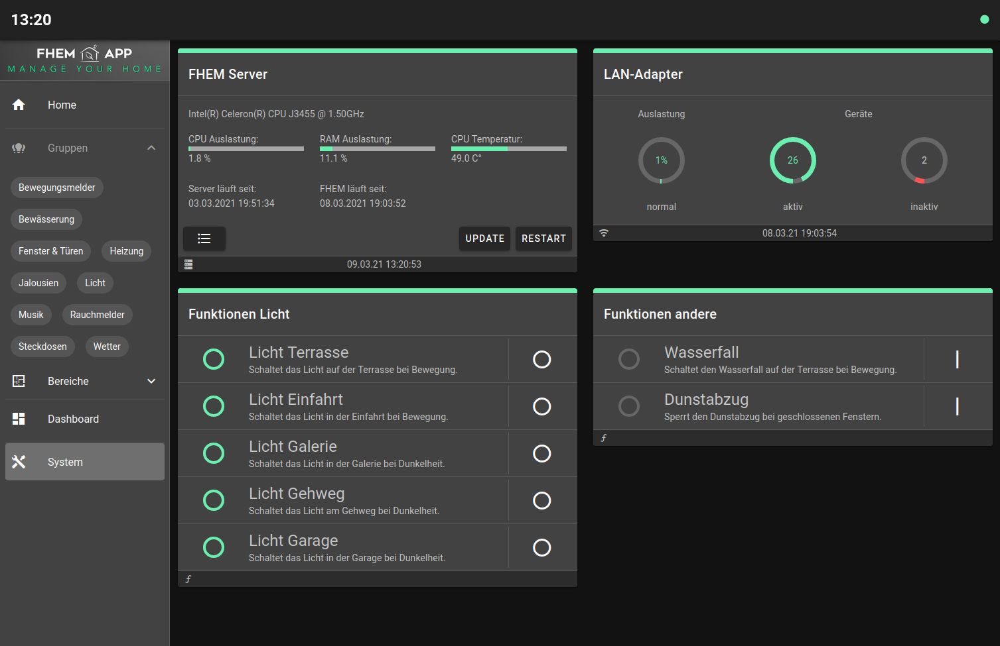

# FHEM App
**FHEMApp** ist eine Web-Application zur Steuerung deiner Smarthome Umgebung. Sie wurde als Frontend für den Einsatz mit FHEM(tm) entwickelt. **FHEMApp** ist für den Betrieb auf unterschiedlichen Geräten optimiert. Die Elemente zur Steuerung der verschiedenen SmartHome-Geräte sind sehr einfach zu bedienen. Für die Einrichtung von **FHEMApp** sind keine Programmierkenntnisse erforderlich. **FHEMApp** wird komplett über FHEM konfiguriert.

*Beispiel für eine Startseite in der Desktopansicht*

*Beispiel für Geräte in der Desktopansicht*

*Beispiel für Grafiken in der Desktopansicht*

*Beispiel für Systemzustand in der Desktopansicht*


*Beispiele für die App in der Smartphoneansicht*

# Systemanforderungen
Für den Betrieb der **FHEMApp** wird FHEM(tm) und ein Web-Server benötigt.
* Backendsystem - FHEM https://fhem.de/
* Webserver - z.B. Apache https://httpd.apache.org/

# Installation
Kopiert einfach alle Dateien und Unterverzeichnisse aus dem Ordner [www/fhemapp](./www/fhemapp) auf das Arbeitsverzeichnis eures Webservers. Danach sollte folgende Verzeichnisstruktur auf eurem Webserver vorhanden sein.
```bash
.
└─ fhemapp
    ├── favicon.png
    ├── index.html
    ├── cfg
    ├── css
    ├── img
    └── js
```

# Konfiguration der Web-Application
Die initiale Konfiguration von **FHEMApp** erfolgt über die Datei `config.json` welche sich im Verzeichnis `../fhemapp/cfg/` befindet. Die Konfigurationsdatei könnt ihr über einen normalen Texteditor bearbeiten, um die folgenden Einstellungen vorzunehmen.

### Verbindungseinstellung für FHEM
Hier wird festgelegt, wo sich die FHEM Installation befindet. Der Parameter `location` gibt die IP-Adresse bzw. URL von FHEM an. Die Parameter `port` und `path` entsprechen dem Standard eurer FHEM Installation und können bei Bedarf angepasst werden.
```
"connection": {
  "location": "http://fhem",
  "port": "8083",
  "path": "fhem"
},
```

### Performanceeinstellungen für FHEMApp (optional)
Wenn ihr in **FHEMApp** Daten aus FHEM-Logs in Charts darstellt, ist es ggf. sinnvoll die Anzahl der `maxChartPoints` zu reduzieren um die Ladezeit zu verkürzen. Über den Parameter `logBuffer` könnt ihr die Anzahl der Logeinträge verändern, die **FHEMApp** zwischenspeichert. Dies ist nur für die Fehleranalyse notwendig.
```
"options": {
  "maxChartPoints": 100,
  "logBuffer": 500
},
```

### Themeneinstellungen für FHEMApp (optional)
Zusätzlich könnt ihr das Farbschema von **FHEMApp** individuell anpassen. Grundsätzlich könnt ihr zwischen einem *dunklen* und einem *hellen* Layout über den Parameter `dark` (`true` bzw. `false`) wechseln. Weiterhin könnt ihr die einzelnen Farben für die beiden Farbschemen unter dem Parameter `themes` individuell anpassen. Siehe dazu auch [(Vuetify Customizing)](https://vuetifyjs.com/en/features/theme/#customizing)    
```
"theme": {
  "dark": true,
  "themes": {
    "light": {
      "primary": "#78909C",
      "secondary": "#CFD8DC",
      "accent": "#8bc34a",
      "error": "#e91e63",
      "warning": "#ffc107",
      "info": "#03a9f4",
      "success": "#4caf50"
    },
    "dark": {
    }
  }
}
```

# Grundeinstellung in FHEM
Bevor ihr in FHEM die gewünschten Geräte für die **FHEMApp** konfiguriert sind zwei Grundeinstellungen notwendig. Die folgenden Schritte setzen voraus, dass ihr mit FHEM vertraut seid.
1. Müsst ihr in eurem *FHEM-Device* `FHEMWEB` die beiden Attribute `CORS` auf `1` und `longpoll` auf `websocket` setzen. [(siehe auch)](https://fhem.de/commandref_DE.html#FHEMWEB) Das folgende Beispiel zeigt einen Auszug aus der Datei *fhem.cfg* nachdem die Grundeinstellung vorgenommen wurde.
```
define WEB FHEMWEB 8083 global
attr WEB CORS 1
attr WEB longpoll websocket
attr WEB stylesheetPrefix default
```
2. Müsst ihr unter `Global` ein neues User-Attribut `appOptions` definieren. [(siehe auch)](https://fhem.de/commandref_DE.html#global) Das folgende Beispiel zeigt einen Auszug aus der Datei *fhem.cfg* nachdem das User-Attribut hinzugefügt wurde.
```
attr global userattr appOptions:textField-long
```

# Konfiguration der Geräte in FHEM
Jedes SmartHome-Gerät (Device) welches in **FHEMApp** angezeigt werden soll, konfiguriert ihr nun direkt in FHEM. Dazu verwendet ihr das neu angelegte FHEM-Attribut `appOptions` sowie weitere FHEM-Attribute wie `alias`,`group`,`room` oder `sortby`.

### Template festlegen
Damit ein Gerät in der **FHEMApp** zur Verfügung steht, müsst ihr dem jeweiligen Device in FHEM ein *Template* zuordnen. In der **FHEMApp** stehen verschiedene [Templates](#übersicht-der-verfügbaren-templates) zur Verfügung. Dazu nutzt ihr das FHEM-Attribut `appOptions`  und definiert ein *Template* über folgenden Parameter  `{ "template": "switch" }` (Beispiel für einen Schalter)

### zusätzliche Attribute setzen
Nachdem ihr dem Device ein *Template* zugeordnet habt, könnt ihr defnieren unter welchem *Name* und in welchen *Menüpunkten* euer Device in **FHEMApp** angezeigt wird. Dazu nutzt ihr das FHEM-Attribut `alias` für den Name des Gerätes, das FHEM-Attribut `group` für die Anzeige im Menüpunkt *Gruppen* und das FHEM-Attribut `room` für die Anzeige im Menüpunkt *Bereiche*.

Zusätzlich könnt ihr Devices auf der *Startseite* oder unter den Menüpunkten *System* bzw. *Dashboard* anzeigen. Die Definition erfolgt ebenfalls über das FHEM-Attribut `appOptions` und über folgende Parameter `"home": "true"`, `"system": "true"`, `"dashboard": "true"`. Wenn ihr euer Device z.B. als Schalter und zusätzlich auf der Startseite von **FHEMApp** darstellen wollt, dann sieht euer FHEM-Attribut `appOptions` so aus: { "template": "switch", "home": "true" }

*Definition in FHEM*<br>


*Anzeige in FHEMApp*<br>


# Übersicht der verfügbaren Templates
| Template | Beschreibung |
|----------|--------------|
| [switch](#template-switch) | Schalteraktoren (optional mit Leistungsmessung) |
| dimmer | Dimmer |
| light | Lichtschalter |
| thermostat | Raumthermostat |
| shutter | Jalousieschalter |
| thermometer | Temperatursensor |
| smokedetect | Rauchmelder |
| contact    | Tür/Fensterkontakt |
| motiondetect | Bewegungsmelder |
| watersensor | Zisternensensor |
| sonos | Sonosplayer |
| panel | Panel zur Gruppierung mehrerer Devices |
| chart | Diagramm zur Visualisierung von Log-Daten |
| weather | Wettervorhersage (darksky-API) |
| scenes | LightScenes |
| sysmon | Systemmonitor |
| hmlan | HMLAN-Adapter |

### Template Switch
